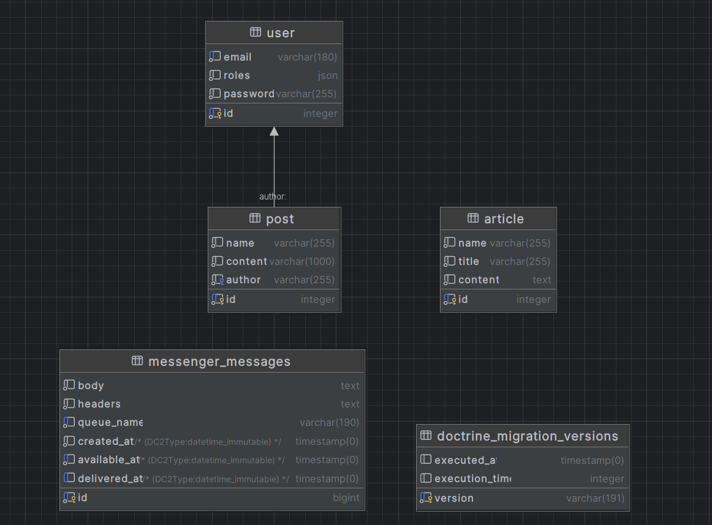
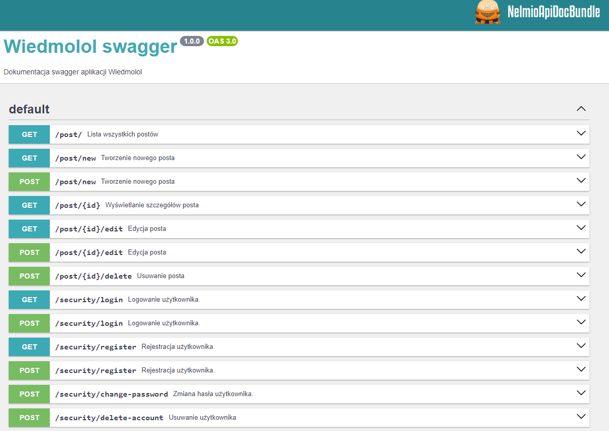
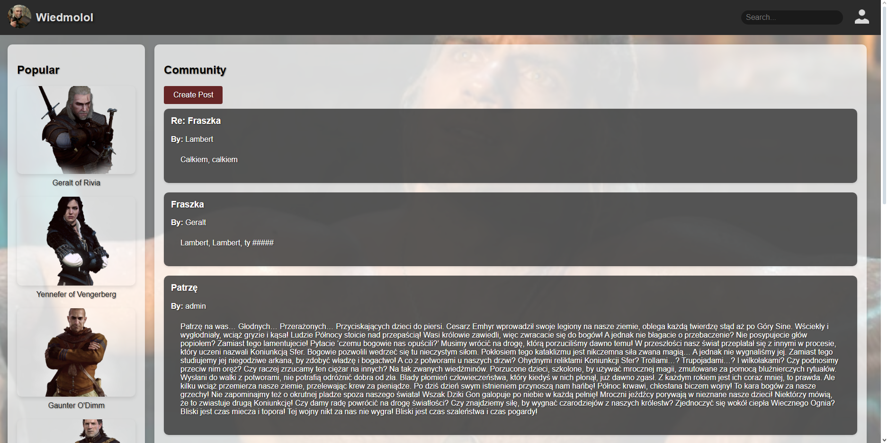
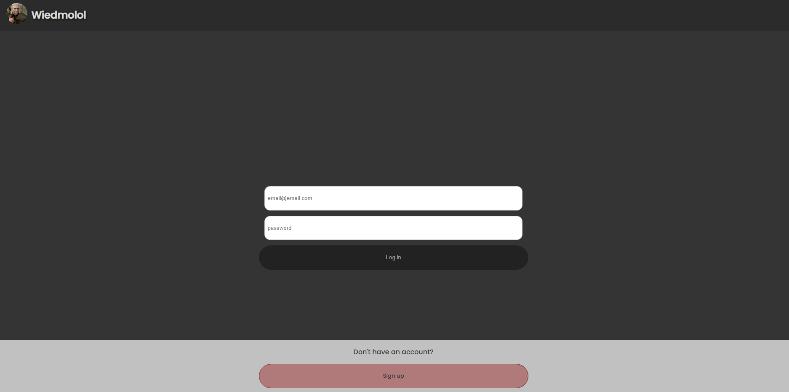
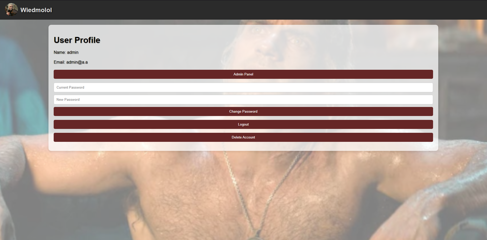
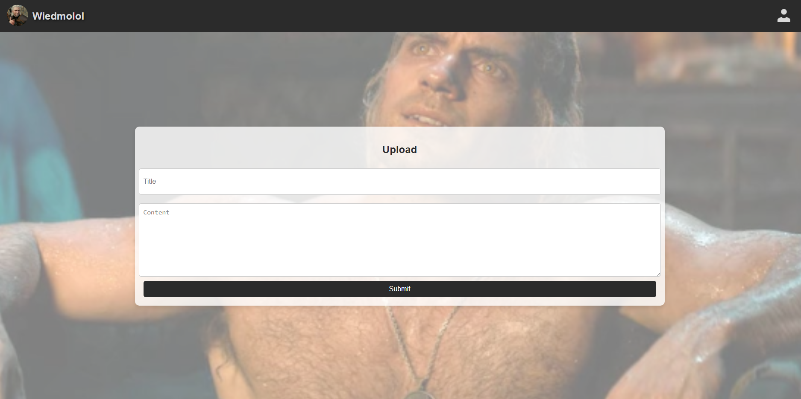
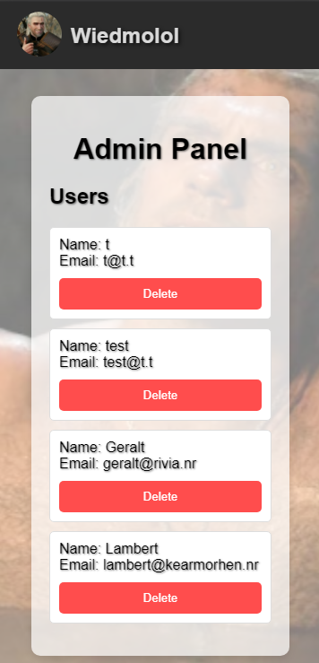
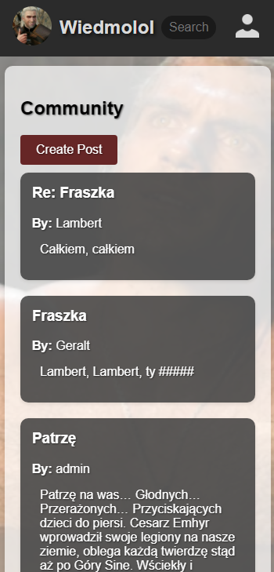
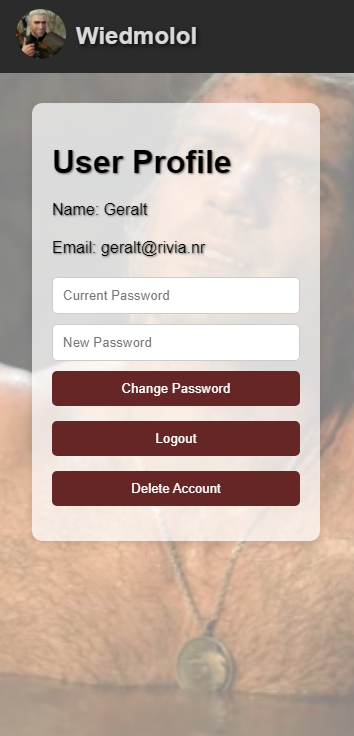
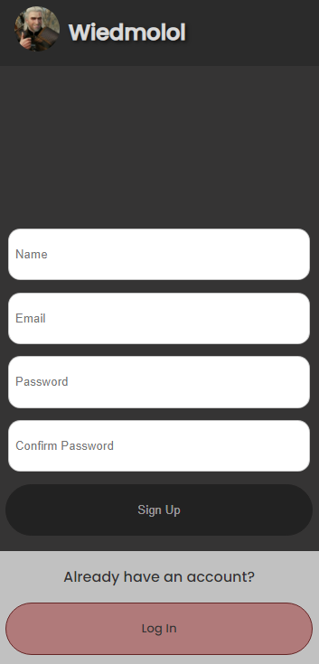

# Wiedmolol Application

Wiedmolol is an application designed for fans of the Witcher Universe, providing detailed information on numerous
characters. Users can register to add and search posts, with distinct privileges for regular users and administrators.

## Table of Contents

1. [Features](#features)
2. [Technologies](#technologies)
3. [Database Design and Structure](#database-design-and-structure)
4. [Screenshots](#screenshots)
5. [License](#license)

## Features

1. User Registration and Login:
    - Both administrators and regular users can register and log into the system.
2. Role-Based Access Control:
    - Regular Users
        - can visit character pages read and add posts.
    - Administrators
        - have all user capabilities
        - can display all users and delete them.
3. Post Search Functionality:
    - Users can search for posts using keywords to find specific content.
4. Password Management:
    - Users can change their passwords after registering to enhance security.
5. Comprehensive Authentication and Authorization:
    - Authentication:
        - Ensures users are who they claim to be through secure login credentials.
    - Authorization:
        - Determines what authenticated users can do within the application, with access to specific features based on
          their role (regular user or administrator).
6. Character Information:
    - Provides information on various characters from the Witcher Universe, making it a valuable resource for fans.
7. Responsive Design:
    - The application is designed to be accessible on various devices.

## Technologies

- HTML/Twig
- CSS
- JavaScript
- PHP/Symfony
- PostgresSQL
- Docker

## Database Design and Structure

The application utilizes a PostgresSQL database with tables designed for users and posts. Key features include:

- `user`: Stores user data:
    - email
    - password
    - roles
- `post`: Stores post details:
    - name
    - content
    - author linked with user email in `users`
- `article`: Stores article data:
    - name
    - title
    - content

## Screenshots

Below are screenshots from various parts of the Wiedmolol application, showcasing the interface for desktop and mobile
devices:

## License

This project is licensed under the [MIT License](LICENSE.md) - see the file for details.